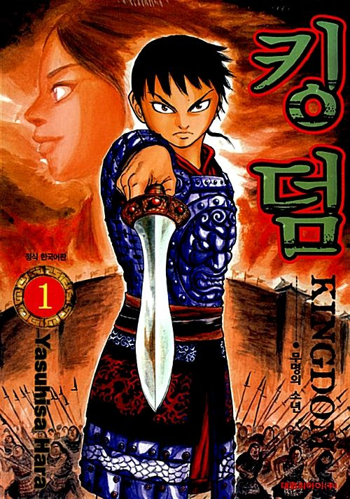

## FIVE STAR STORIES(FSS)

### 파이브 스타 스토리 설명 【[~2012](https://namu.wiki/w/%ED%8C%8C%EC%9D%B4%EB%B8%8C%20%EC%8A%A4%ED%83%80%20%EC%8A%A4%ED%86%A0%EB%A6%AC)】 【[2013~](https://namu.wiki/w/%ED%8C%8C%EC%9D%B4%EB%B8%8C%20%EC%8A%A4%ED%83%80%20%EC%8A%A4%ED%86%A0%EB%A6%AC(2013))】

## KINGDOM

### 1.개요 - 중국 전국시대 말기를 배경으로 한 일본 만화

### [2](https://namu.wiki/w/킹덤(만화)/줄거리#s-2).줄거리

- 기원전 262년: 진나라와 조나라의 전쟁 발발.
- 기원전 260년: 진나라 [육대장군](https://namu.wiki/w/육대장군) [백기](https://namu.wiki/w/백기)가 조나라 포로 40만명을 산 채로 파묻어버리는 것으로 2년 동안 이어졌던 **[장평대전](https://namu.wiki/w/장평대전)**이 끝나다.[[1\]](https://namu.wiki/w/킹덤(만화)/줄거리#fn-1)
- 기원전 259년: 조나라 도성 한단에서 진나라 왕족인 영정이 탄생했는데, 장평대전의 원한으로 인해 **어머니와 함께 조나라 백성들에게 갖은 박해를 받으며 성장**하다.
- 기원전 252년: **전신(戰神)이라 불리던 진나라 [소왕](https://namu.wiki/w/소양왕)** 사망.
- 기원전 251년: 여불위의 의뢰를 받은 **상인 시카 일당에 의해 영정의 구출 작전이 시행되고, 관계자 전원의 목숨을 댓가로 영정은 살아남았으며,** 지원을 나왔던 창문군, 벽 일행과 함께 함양에 도착하였다.(7권 74화 ~ 8권 82화 앞 부분)
- 기원전 246년: **영정이 진나라의 왕위에 오르다.**
- 기원전 245년(시황제 2년, 1권 ~ 10권)
- 기원전 244년(시황제 3년, 11권 ~ 16권)
- 기원전 243년(시황제 4년, 17권 ~ 18권)
- 기원전 242년(시황제 5년, 18권 ~ 24권)
- 기원전 241년(시황제 6년, 24권 ~ 33권)
- 기원전 240년(시황제 7년, 34권)
- 기원전 239년(시황제 8년, 34권 ~ 38권)
- 기원전 238년(시황제 9년, 38권 ~ 41권)
- 기원전 237년(시황제 10년, 41권 ~ 46권)
- 기원전 236년(시황제 11년, 46권 ~ 60권)
- 기원전 235년(시황제 12년, 60권 ~ 62권)
- 기원전 234년(시황제 13년, 62권 ~ )

| 【[711](http://flash24.co.kr/g4/bbs/board.php?bo_table=cartoon&wr_id=10022&page=5)】 | 【[712](http://flash24.co.kr/g4/bbs/board.php?bo_table=cartoon&wr_id=10038&page=5)】 | 【[713](http://flash24.co.kr/g4/bbs/board.php?bo_table=cartoon&wr_id=10055&page=5)】 | 【[714](http://flash24.co.kr/g4/bbs/board.php?bo_table=cartoon&wr_id=10064&page=5)】 | 【[715](http://flash24.co.kr/g4/bbs/board.php?bo_table=cartoon&wr_id=10078&page=5)】 | 【[716](http://flash24.co.kr/g4/bbs/board.php?bo_table=cartoon&wr_id=10100&page=5)】 | 【[717](http://flash24.co.kr/g4/bbs/board.php?bo_table=cartoon&wr_id=10115&page=5)】 | 【[718](http://flash24.co.kr/g4/bbs/board.php?bo_table=cartoon&wr_id=10126&page=4)】 | 【[719](http://flash24.co.kr/g4/bbs/board.php?bo_table=cartoon&wr_id=10148&page=4)】 | 【[720](http://flash24.co.kr/g4/bbs/board.php?bo_table=cartoon&wr_id=10170&page=4)】 |
| :----------------------------------------------------------: | :----------------------------------------------------------: | :----------------------------------------------------------: | :----------------------------------------------------------: | :----------------------------------------------------------: | :----------------------------------------------------------: | :----------------------------------------------------------: | :----------------------------------------------------------: | :----------------------------------------------------------: | :----------------------------------------------------------: |
| 【[721](http://flash24.co.kr/g4/bbs/board.php?bo_table=cartoon&wr_id=10188&page=4)】 | 【[722](http://flash24.co.kr/g4/bbs/board.php?bo_table=cartoon&wr_id=10201&page=4)】 | 【[723](http://flash24.co.kr/g4/bbs/board.php?bo_table=cartoon&wr_id=10217&page=3)】 | 【[724](http://flash24.co.kr/g4/bbs/board.php?bo_table=cartoon&wr_id=10243&page=3)】 | 【[725](http://flash24.co.kr/g4/bbs/board.php?bo_table=cartoon&wr_id=10264&page=3)】 | 【[726](http://flash24.co.kr/g4/bbs/board.php?bo_table=cartoon&wr_id=10293&page=2)】 | 【[727](http://flash24.co.kr/g4/bbs/board.php?bo_table=cartoon&wr_id=10308&page=2)】 | 【[728](http://flash24.co.kr/g4/bbs/board.php?bo_table=cartoon&wr_id=10324&page=2)】 | 【[729](http://flash24.co.kr/g4/bbs/board.php?bo_table=cartoon&wr_id=10343&page=2)】 | 【[730](http://flash24.co.kr/g4/bbs/board.php?bo_table=cartoon&wr_id=10365)】 |
| 【[731](http://flash24.co.kr/g4/bbs/board.php?bo_table=cartoon&wr_id=10377)】 | 【[732](http://flash24.co.kr/g4/bbs/board.php?bo_table=cartoon&wr_id=10393)】 | 【[733](http://flash24.co.kr/g4/bbs/board.php?bo_table=cartoon&wr_id=10404)】 | 【[734](http://flash24.co.kr/g4/bbs/board.php?bo_table=cartoon&wr_id=10416)】 | 【[735](http://flash24.co.kr/g4/bbs/board.php?bo_table=cartoon&wr_id=10426)】 | 【[736](http://flash24.co.kr/g4/bbs/board.php?bo_table=cartoon&wr_id=10472)】 | 【[737](http://flash24.co.kr/g4/bbs/board.php?bo_table=cartoon&wr_id=10483)】 | 【[738](http://flash24.co.kr/g4/bbs/board.php?bo_table=cartoon&wr_id=10496)】 | 【[739](http://flash24.co.kr/g4/bbs/board.php?bo_table=cartoon&wr_id=10508)】 | 【[740](http://flash24.co.kr/g4/bbs/board.php?bo_table=cartoon&wr_id=10522)】 |
| 【[741](http://flash24.co.kr/g4/bbs/board.php?bo_table=cartoon&wr_id=10540#c_10542)】 |                         【**742**】                          |                           【743】                            |                           【744】                            |                           【745】                            |                           【746】                            |                           【747】                            |                           【748】                            |                           【749】                            |                           【750】                            |

- 기원전 233년(시황제 14년, )

### 3. TV Animations

- 【[Season 1](https://ohli24.net/c/%ED%82%B9%EB%8D%A4)】 【[Season 2](https://ohli24.net/c/%ED%82%B9%EB%8D%A4%202%EA%B8%B0)】 【[Season 3](https://ohli24.net/c/%ED%82%B9%EB%8D%A4%20(2020))】 【[Season 4](https://ohli24.net/c/%ED%82%B9%EB%8D%A4%204%EA%B8%B0)】 【Season 5】

## Useful Sites

* [애니24](https://ohli24.net/)

