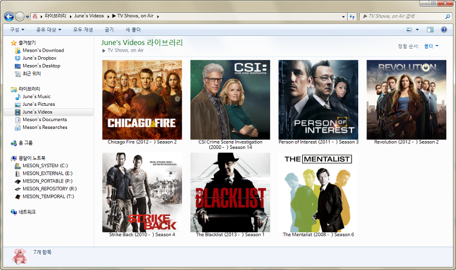
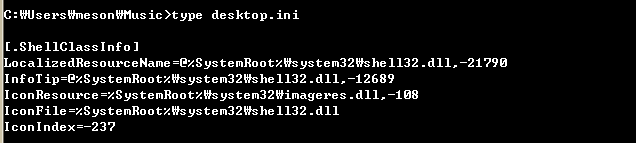
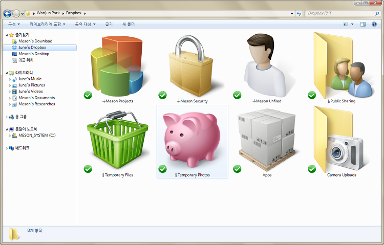
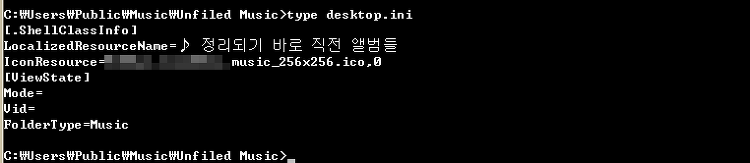
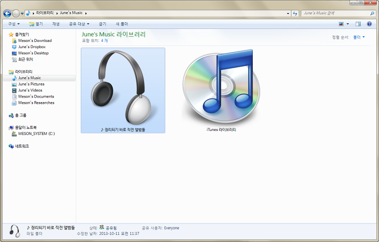
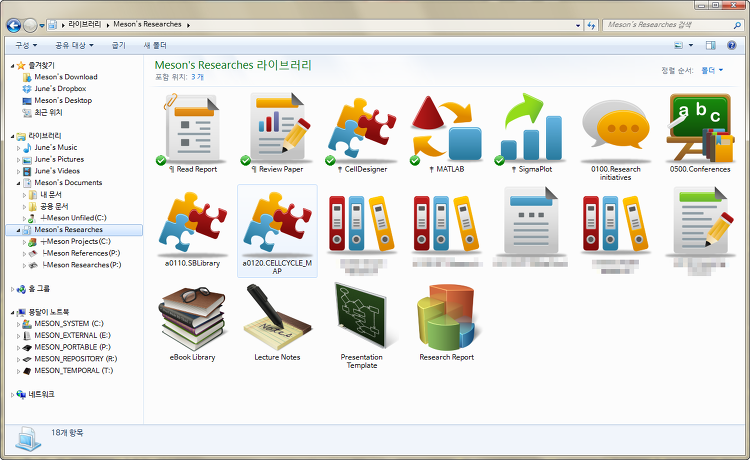
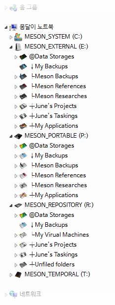
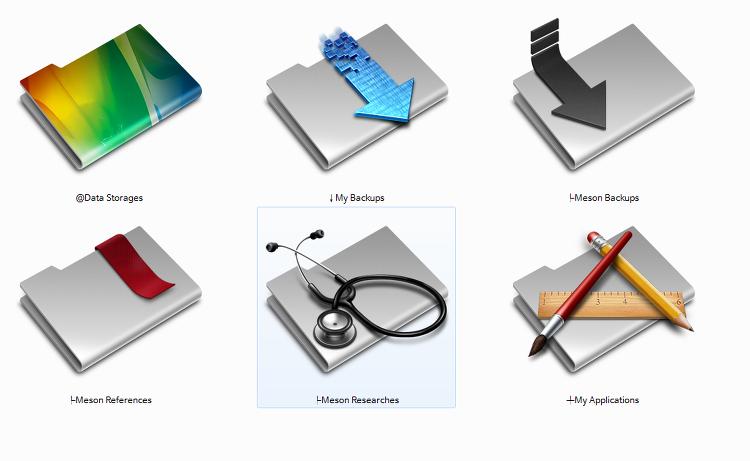
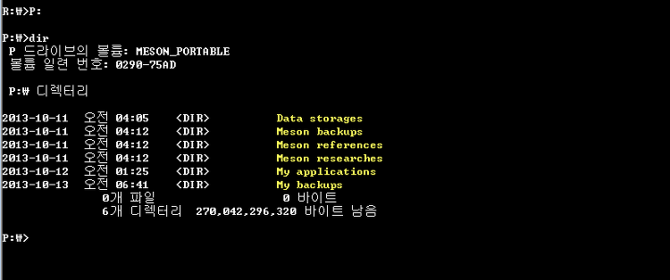
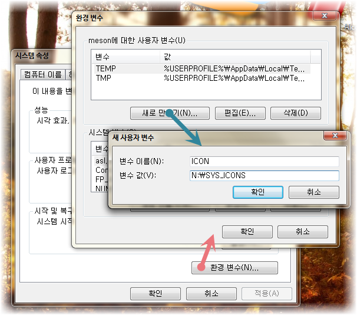

# 폴더 관리에 대해서 - 보이는 것이 전부가 아니다

> ◈ 원문 출처
>
>  - [몽달이블로그](https://blog.meson.kr/467)

수많은 컴퓨터 데이터를 정리하기 위해서 가장 먼저 떠오르는 생각은 **폴더구조(folder; directory)**일 것이다.
데이터의 성격, 역할에 따라서 적당한 디렉토리 구조를 만들어 해당 디렉토리 이름으로 기능 및 성격을 정하면
사용자가 쉽게 알아보기 편하고 이후 자신이 원하는 데이터를 찾기도 편할 것이다. 
그러나, 이 방법은 지극히 인간인 사용자를 위한 방법이고 사실 파일구조 상으로는 디렉토리 구조가 
컴퓨터에게도 직관적인 방법인지는 알 수 없다. 
다시 말해 디렉토리 구조가 컴퓨터가 원하는 기능을 수행하는데 정말 편리한 구조인지 아닌지는 모른다.
그러나 중요한 것은 결국 그 기능의 사용자는 인간이기 때문에 결국 조금 더 계산을 하거나 컴퓨터에게
번거로운 구조라고 하더라도 인간이 더욱 편한 것이 중요할 것이다. 

모 소프트웨어 회사의 압축 프로그램에서 '새 폴더' 를 만들면 새로운 폴더인 New Folder가 아닌 
새(bird) 이름을 가진 폴더 이름이 만들어져 '가마우지', '까마귀' 등 다양한 새 이름의 폴더가 만들어 진다.
느낌은 새롭고 신선하지만 결국 그 이후 해당 프로그램의 영향으로 사람들의 컴퓨터에는 정말 다양한
조류 이름의 폴더들을 많이 볼 수 있었다. 
그만큼 사용자들은 **폴더를 단순히 데이터를 잘 구별하고 구성하기 위한 방법으로 사용하기 보다는**
**지금까지의 데이터와 조금 구별하기 위한 방법**으로 편하게 사용한다는 것을 느끼게 되었다.

사실 맥OS가 제공하는 **스팟라이트 (Spotlight)**는 가장 효과적인 방법이란 생각은 든다.
예를 들어 내가 **작업하는 문서와 자료에 집중하지 사실상 어디에 두어야 하는지까지 고민할 필요없는 상황**이 가장 좋은 것이다.
그러나 이후 관련있는 자료들을 모아서 한꺼번에 검토하고 싶은 순간이 있기 때문에 폴더로 관리하는 방법은 제거할 수 없게 된다.
물론 폴더 방법을 대체할 수 있는 방법으로 태그(tag)를 사용하는 방법이 있지만 거의 대부분은 태그를 붙이는 작업보다
그냥 폴더로 관리하는 것에 익숙해 있거나 더 편리한 방법이 된다.

그래서 어느 순간부터 열심히 작업한 자료들을 체계적으로 나름대로 관리할 수 없는지에 대해서 관심을 가지게 되었다.
폴더 관리도 다양한 방법으로 시도해보고 시행착오도 겪어 보던 중 우연히 원도우 계열(Windows) 계열에서 **폴더의 모양(아이콘)을**
**변경하는 방법**을 자주 사용하게 되었다.

예를 들어 비디오 파일을 나타내는 필름이 그려진 아이콘은 직관적으로 동영상을 담고 있는 폴더라고 생각하게 된다.
만약 모두 동일한 폴더에 폴더명으로만 구별을 한다면 정렬(sort)이 바뀌거나 아이콘의 크기가 변경되면 바로 찾기가 쉽지 않다는 것이다.
폴더를 아이콘으로 꾸미는 작업을 하고 나면 원도우 계열은 폴더에 숨김, 시스템 속성을 가진 파일 하나가 만들어 진다.
desktop.ini이란 파일인데 속성은 숨김, 시스템이지만 실제로 폴더의 아이콘 위치을 포함한 폴더 속성을 나타내는 일반 텍스트(plain text) 파일이다.  

### **What is desktop.ini ?** 

이 파일에 대해서 인터넷에서 검색을 해보면 파일의 특징이나 사용법보다는 바이러스에 관련된 내용이 더 많이 검색되는 것을 알 수 있다.
이 파일은 상당히 오래 전부터 원도우 계열에서 사용되던 파일이다. 그런데 이 파일은 autorun 파일과 비슷하게 실행 능력을 가지고 있기 때문에 이런 취약점을 이용해서 파일을 제거하거나 악성 코드를 실행시켜 심는 방법으로 사용되기도 했다. 그러나 이 부분에 대해서는 거의 안심해도 될 것이다. 일단 이런 기초적인 취약점은 파악되었고 이제 보안 프로그램 (백신, 악성코드 제거 프로그램 등) 은 실행단계에서 악성코드의 특징을 파악해서 막기 때문에 이런 부분에 대한 걱정하지 않아도 될 것 같다. 이런 위험성 때문에 컴퓨터에 있는 모든 desktop.ini 을 포함한 몇가지 숨김 속성을 가지는 파일들을 지우는 경우가 많은데 이렇게 되면 해당 파일이 가지는 유용성을 쓰지 못하게 될 것이다. 

우선 desktop.ini 은 앞서 소개한 폴더 아이콘을 변경하면 자동으로 생성된다. 파일 내용에는 지정한 아이콘이 지정된 위치가 기록된다. 
desktop.ini 파일에 대해서 더 알아보려면 원도우를 설치한 초기에 만들어지는 폴더에 주목할 필요가 있다. 내 폴더 라는 이름 아래 내 문서, 내 음악 등과 같이 기본적으로 생성된 폴더가 있다. 예를 들어 내 음악이란 폴더를 살펴보면 탐색기에서 보이는 폴더 명은 '내 음악' 이고 영문 원도우에서는 'My Music' 이다. 해당 폴더를 디스크에 경로로 찾아가보면 의외의 결과를 만나게 된다. 한글 원도우, 영문 원도우에 상관없이 폴더의 경로는 C:\users\%USERNAME%\music 이다. 여기에서 %USERNAME% 은 자신이 로그인 한 계정명이다. 즉, 디스크에서 기록된 폴더 경로는 정해져 있고 원도우에서 보여지는 폴더 명은 다른 것이다. 이 현상에 주목해서 해당 폴더에 숨겨져 있는 desktop.ini 을 살펴보면 다음과 같다. 

뭔가 복잡해 보이는 내용이 숨겨져 있지만 IconFile 및 IconIndex 는 폴더 아이콘을 나타내는 정보임을 추측할 수 있을 것이다. InfoTip 은 해당 폴더에 마우스가 포커스(focus) 가 맞춰졌을 경우 보여주는 정보로 풍선도움말 같은 내용일 것이다. 그리고 추측하건데 해당 경로에 존재하는 대상 파일을 이용한다는 것을 추측할 수 있을 것이다. 주목할 부분은 바로 맨 첫줄에 있는 LocalizedResourceName 이다. 말 그대로 로컬에서만 사용되는 리소스 이름을 표시한다. 그리고 조금의 모험심으로 탐색기에서 해당 폴더이름을 변경해본다. (이름 변경을 위한 단축키는 보통 F2 이다. 혹은 메뉴에서 찾아도 된다.) 상식적으로 생각해 보면 폴더 명을 변경했기 때문에 폴더명따라 경로 명도 변경되는 것이 상식적일 것 같다. 예를 들어 폴더 명을 'My Own Music' 으로 변경했다면 "C:\users\%username%\My Own Music" 으로 바뀔 법한데 폴더 경로는 여전히 그대로이고 변경되는 것은 desktop.ini 의 LocalizedResourceName 의 값만 내가 변경한 이름으로 변경되어 있다. 

즉, 폴더에 desktop.ini 이 존재하면 해당 폴더 경로는 고정되고 탐색기에서 어떤 이름으로 변경을 해도 폴더 경로에는 변화가 없는 것이다. 물론 명령어줄 (cmd) 를 통해서 폴더이름 변경 명령어 (ren) 을 사용해서 변경하면 폴더 이름은 변경된다. 

### Presentation layer vs. Operation layer

2000년대 초반 상용 데이터베이스 회사에서는 다양한 구조를 소개했다. 그중 여전히 기억에 남는 것은 Presentation Layer 이다. 데이터베이스를 기본 core 를 가지는 Database Layer 와 그 위에는 그 데이터베이스를 처리하해서 우리가 원하는 결과를 만들어 내는 Business Layer 그리고 그 결과값을 사용자들이 이해하기 편하게 보여주는 Presentation Layer 로 구별해서 보여준 것이다. 사실 이 개념은 OSI (Open Systems Interconnection) 모델의 7계층 (Seven-Layers) 중 6번째 구조를 설명하는 이름이지만 복잡하고 어려운 개념을 떠나서 폴더 관리에 한정지어 생각해보도 충분히 유용할 것이다. 

앞서 보여준 폴더 경로는 고정되어 있지만 폴더를 어떻게 사용자에게 보여주는지에 따라서 폴더명, 폴더 아이콘 등과 같은 형태를 변경 시키거나 더 나아가 폴더의 속성 (음악, 비디오, 문서 속성을 지정할 수 있다.) 까지 정해서 좀 더 보기 편하도록 설정해주는 방법을 제공해준다. 즉, 파일 구조 상에서 운영되는 (operative aspect) 방법은 폴더 경로를 이용하지만 우리에게 그 폴더를 보여주는 방식은 우리에게 좀 더 편리한 방식을 제공해 준다. 이 개념을 presentation layer 와 operation layer 로 구별해서 생각해보면 좋을 것 같다. 즉, 폴더 경로와 같이 C:\users\%USERNAME%\music 은 사용자에게 직접 보여주지 않지만 실제로 운영 체제가 참조하거나 파일의 위치를 확인할 때 이용하는 경로이지만 사용자에게 이와 같은 naive naming 은 보여주지 않고 사용자가 좀더 편리하게 사용할 수 있는, 사용자가 원하는 폴더 명을 사용할 수 있도록 해주는 것이다. 즉, 전자는 operation layer 부분이고 후자는 presentation layer 라고 설명하면 좋을 것이다. 즉, 우리가 신경쓰지 않는 operation layer 와 우리가 직접 보고 찾아가는 presentation layer 를 desktop.ini 와 같은 폴더 속성을 만드는 파일을 이용해 간단하게 구성할 수 있다는 점이다. 

### **폴더 관리의 묘미**

폴더를 잘 관리하면 업무, 작업의 효율이 증가할까? 라는 질문에 대해서는 개인적 차이가 있다고 얘기할 수 밖에 없을 것이다. 폴더 관리에 너무 신경을 많이 쓰면 관리하는데 너무 많은 신경을 쓰게 되어 원래 업무에 집중하지 않을 수도 있지만 일단 잘 관리를 하게 되면 업무 인계 혹은 작업의 공유를 할 때 별도의 작업을 하지 않고 폴더 단위로 공유를 하거나 넘기면 편리하기 때문에 장단점이 있다고 얘기할 수 밖에 없다. 개인적으로 폴더 관리를 선호하는 편이다. 그런데 여기에는 여러가지 문제가 있다. 폴더 명에 모든 정보를 다 표시하며 폴더 이름을 정하기도 불편하고 나중에 폴더 이름을 잘 관리해서 만들어도 폴더 갯수가 증가하면 어떻게 관리해야 하는지 문제가 될 때가 많다. 즉, 폴더 이름 순서대로 정렬 (sorting) 이 될 수 있도록 폴더 이름을 관리하는 방법이 존재할 것이다. 그동안 시행착오를 거친 내용을 잠시 소개하면, 

1. 4자리 분류법: 알파벳+세자리숫자 (e.g.: a010. 폴더 이름 ) 과 같이 정리하는 방법이다. 특히 연구 프로젝트나 작업 내용의 내용이 많아질 때 사용하는 방법으로 맨 앞자리 a 의 경우 일의 성격에 따라 구별한다. 예를 들어 Project Initiatives 와 같이 시작하려는 내용은 a, 진행중인 내용은 b (business) 로 종결된 것은 c (complete), 문서 작업은 d (documents), 일반 작업은 g (general) 과 같이 분류하고 숫자 세개는 일의 성격 분류와 두자리 숫자는 일련 번호와 같이 정했다. 이런 분류법은 상당히 유용해 보일 수 있지만 일반적인 폴더 분류의 가장 큰 단점이 보인다. 예를 들어 일의 성격이 명확하게 구별되는 프로젝트가 아닌 서로 관련이 있는 내용이 있을 때는 자료를 중복시켜야 하기 때문에 문서의 버젼 (version) 관리 문제가 발생한다. 
2. 폴더없는 관리 방법 (folderless) : 예를 들어 논문으로 다운 받은 문서들은 특별히 정리하지 않고 한 폴더에 모두 몰아 넣어버린다. 그리고 이를 관리하는 프로그램을 별도로 사용하는 것이다. 예전 블로그 [ 정보의 가공 및 개인화 - 논문 작성을 중심으로 ; blog.meson.kr/377 ] 에서 소개한 멘델레이 (Mendeley) 와 같은 관리 프로그램을 사용하고 더이상 폴더 관리를 하지 않는 것이다. 비슷한 내용으로 음원 파일을 관리하기 위해서 iTunes 를 이용해서 관리하는 방법도 동일하다. 즉, 특정 파일의 경우 해당 프로그램이 관리하는 방식을 전적으로 신뢰하는 것이다. 개인적으로 애플 기기 (아이폰, 아이팟 등) 을 사용하지 않지만 iTunes 에 음원파일을 넣으면 iTunes Library 폴더에 음악가 / 앨범 등의 분류에 따라서 자동으로 관리하는 방식을 그대로 따른다. 그리고 해당 iTunes 라이브러리 폴더 하나만 백업해서 관리하게 된다. 
3. 클라우드 파일 저장소 (cloud file storage) : 온라인이 아닌 상황에서도 필요한 파일이 아니라면 특별히 로컬 디스크에 넣어 두어 사용할만큼 사용빈도가 높지 않다면 클라우드 서비스에 올려놓고 해당 클라우드 서비스의 검색 기능을 이용해서 찾아내는 방식이다. 예를 들어 PDF 파일과 같이 문서 내부의 검색도 빠르게 찾아주기 때문에 이런 측면에서 유리하다. 개인적으로 이런 목적을 위해 사용하는 클라우드 서비스는 구글 드라이브 (Google Drive) 이다. 현재는 기존의 구글 독스 (Google Docs) 의 온라인 문서 작업 서비스에서 모든 데이터를 저장할 수 있기 때문에 (개별 파일의 용량 제한이 없지만 실질적으로 2G 정도로 보면 된다.) 광범위 목적으로 사용할 수 있다. 또한 요즘에 많이 사용되는 협업 시스템 (collaborative systems) 에도 상당히 유리한 내용을 제시한다. 

이밖에 몇가지 다양한 시도도 있었지만 가장 최선의 방법은 없다. 경우에 따라서 데이터의 내용, 얼마나 자주 접근하는가, 자료의 형태가 따라서도 달라질 수 밖에 없다. 요즘 가장 사랑하는 웹 서비스는 Dropbox (드랍박스) 인데 폴더, 데이터 관리에 있어서 중요도는 낮지만 가장 번거로운 부분을 해결해주었기 때문이다. 정리되지 않고 일상적으로 인터넷에서 떠도는 그림 파일, 문서 파일 등을 받아 놓고 분류하기 애매한 내용들은 관리하기도 불편하고 번거롭기만 하다. 의외로 드랍박스란 온라인 동기화 (synchronization) 서비스를 통해서 별로 관리하지 않는 파일들을 자동으로 동기화 시켜 별 신경쓰지 않는 영역을 만드는 것도 하나의 방법이 된다는 것이다. 

드랍박스의 내용을 살펴보면 § Temporary Files 와 § Temporary Photos 를 만들어 놓았다. 분류하기 번거로운 자료들을 모두 한꺼번에 올려 놓는 것이다. 그리고 문서 작업이지만 아직 Archive (보관) 하기 이전의 내용들은 ╀Meson Unfiled 과 같은 폴더를 통해 분류하지 않고 저장하고 드랍박스에 동기화 되어 어디서든 작업할 수 있도록 한 것이다. 

### **폴더 속성** **(dekstop.ini)** **만들어주기**

폴더 관리를 하지 않아도 충분히 능률이 있다는 분들에게는 별로 도움이 되지 않는 내용이겠지만 원하는 순서대로 정렬이 될 수 있도록 폴더의 성격을 분류할 수 있기를 바라는 분들에게는 도움이 될 수 있을 것 같다. 앞서 presentation layer 와 operation layer 를 설명한 이유가 여기에 있다. operation layer 의 폴더 명은 우리가 보게 될 폴더 명이나 정렬되는 내용이 아니다. 즉, 폴더의 성격을 나타낼 수 있는 가장 간단한 형태의 폴더 명을 정하는 것이 좋다. 즉, "My Music" 과 같은 형태도 나쁘지 않지만 간단히 music 이라고 폴더명을 만들어 놓고 (operation layer) 이에 desktop.ini 파일을 이용해서 더 많은 정보를 표시하는 폴더 명으로 바꾸면 (presentation layer) 원도우 사용에는 자신이 원하는 형태로 사용할 수 있는 것이다. 

실전 예를 살펴보자. 음악 폴더에 iTunes 에 넣기 전에 앨범 정리하는 폴더를 만들고 싶었다. 타인과 공유하고 싶기도 하기 때문에 C:\users\public\music 폴더 밑, 탐색기에서는 '공유 음악' 이라고 표시되는 폴더 안에 '새 폴더' 를 만든다. (진짜 새로운 폴더이다.) 해당 폴더의 이름을 '♪ 정리되기 바로 직전 앨범들' 이란 이름으로 만들고 싶어 폴더 이름도 동일하게 만들면 경로는 music 폴더 밑에 입력한 한글 명으로 그대로 생긴다. 띄어쓰기가 존재하고 라틴 코드 (영문) 가 아닌 폴더명이 나쁜 것은 아니지만 그리 권장하는 것이 아니다. 그리고 무엇보다 나중에 폴더 명이 마음에 안들어 변경하고 싶을 때는 폴더 명과 동일하게 경로 명도 변경되기 때문에 해당 경로로 지정된 프로그램이나 설정값이 있는 경우 모두 꼬이고 만다. 이런 경우를 방지하기 위해 새로운 폴더 이름으로 ⓐ 영문으로 ⓑ 가급적 띄어쓰기 없는 ⓒ 간단한 단어 정도로 폴더 명을 지정한다. 여기에서는 Unfiled Music 이란 이름으로 정했다. 

폴더 경로는 C:\users\public\music\Unfiled Music 이 생성된다. 

새 폴더를 만들기만 하면 desktop.ini 는 존재하지 않는다. 여기에 폴더 아이콘을 변경해보자. 변경 방법은 이전 블로그를 참조하면 된다. [아이콘으로 내 컴퓨터 꾸미기; blog.meson.kr/237 ] 이후 폴더 내 desktop.ini 파일이 만들어지고 명령어 줄 (cmd) 로 들어가서 해당 폴더 경로로 들어가 파일을 편집해준다. (※ 편집 방법은 명령어 줄에서 notepad desktop.ini 을 입력하는 방법이 가장 빠른 방법이다.) 

해당 파일 내에 [.ShellClassInfo] 부분 밑에 LocalizedResourceName=원하는 폴더 이름 으로 입력해주면, 

해당 폴더 이름은 탐색기에서 원하는 이름으로 변경된다. 이후 탐색기에서 이름 변경을 해도 폴더 경로명은 변하지 않는다. 즉, operation layer 의 경로명은 고정되고 presentation layer 의 이름은 이름변경으로 쉽게 변경할 수 있게 된다. 

이처럼 operation layer 를 정해주고 presentation layer 를 변경시키는 것은 여러가지 장점을 가진다. 물론 desktop.ini 파일의 위험성(?) 때문에 이 파일을 모두 삭제하게 되면 폴더 아이콘 뿐만 아니라 폴더명도 모두 폴더 경로명과 동일하게 변경된다. 원도우 계열에서는 desktop.ini 은 제대로 표시가 되지만 폴더를 타 시스템과 공유하거나 클라우드 서비스에 올리는 경우에는 presentation layer 가 아닌 operation layer 의 경로를 이용하게 된다는 점도 참조해야 할 것이다. 그렇기 때문에 클라우드에 백업을 하는 경우 desktop.ini 을 제외하는 경우가 있는데 이런 경우 제외되지 않도록 설정하는 것도 필요하다. 

### **폴더 작명에 대해서 짧은 소견**

어떻게 하는 것이 폴더를 잘 정리하는 것인지 정답은 없다. 자료이 성격, 데이터의 관리 방법에 따라서 그리고 무엇보다 작업의 내용에 따라서 폴더 관리는 정답이 없고 때에 따라서 적절한 방법을 사용하는 것이 필요하다. 그러나 최소한 기본적인 작업 환경 (워크스테이션)이 원도우 계열이라면 폴더 작명에 조금만 신경쓰면 많은 것들이 편하다. 앞서 「폴더 관리의 묘미」를 통해서 여러가지 방법을 제시했지만 특별한 경우가 아니라면 특정 폴더 아래 하위 폴더 (subfolder) 가 수십개가 넘어가면 분류를 포기한 것이나 다름 없지 않나 조심스럽게 생각해본다. (특별한 경우는 아무래도 사진 폴더, 여러개의 프로젝트 등) 그 외는 8개 내외의 대분류와 하위 폴더의 깊이 (depth) 가 4개 이상은 들어가지 않는 범위에서 거의 관리가 가능하다는 결론이 만들어졌다. 

앞서 설명한 presentation layer 의 desktop.ini 폴더 관리 방법을 이용해서 폴더 경로명 (operation layer) 는 간단하게 정렬되지 않아도 그냥 정하고 나서 이후 desktop.ini 의 LocalizedResourceName 항목을 이용해서 presentation layer 의 이름을 마음대로 변경해도 좋다. 이때 정렬되는 방법으로 다양한 특수문자를 이용하는 것을 한번 소개한다. 

한글 자판의 자음 (ㅂ ㅈ ㄷ ㄱ ㅅ ㅁ ㄴ ㅇ ㄹ ㅎ ㅋ ㅌ ㅊ ㅍ) 을 누르고 한자 버튼을 누르면 다양한 특수 문자가 나오는데 가장 많이 사용되는 특수문자의 경우 ㅁ 에 배당되어 있다. ㅎ 의 경우 희랍어의 ㅎ 을 연상하여 그리스문자를 표시할 수 있고 ㄴ 의 경우 문단 꺽은선을 연상하여 문단 꺽은선을 보여준다. 이밖에도 무엇이 있는지 한번쯤 시도하는 것이 좋을 것 같다. 예를 들어 종교에 관련된 문서나 자료의 경우 앞에 † (ㅁ-한자, 6번째줄, 9번째 아이템) 을 표시해서 간단한 마크로 표시를 해주거나 문서의 경우 ¶ 표시, 백업이나 다운로드의 경우에는 ↓ 와 같이 자신이 직관적으로 인식할 수 있는 기호를 이용해서 폴더 명을 정리하는 것이다. 

링크, 공유를 뜻하는 폴더는 § 를 넣는 것과 같이 자신이 자주 사용하는 분류에 의해서 폴더명을 정하는 것이다. 이와 함께 아이콘을 동시에 표시해주면 좀더 편리하게 자신이 찾고자 하는 폴더를 쉽게 찾아 들어갈 수 있게 된다. 이런 방법을 사용하다가 외장하드의 경우에는 좀더 색다른 방법을 사용해 보았다. 특수 문자 중 [ㅂ, 한자] 를 누르면 각종 선문자가 나온다. 선의 방향과 굵기가 다른 다양한 선들이 나오는데 이 선들을 이용해서 폴더 명 앞에 넣어 주면 마치 폴더 트리 구조처럼 만들 수 있다. 

이 중 외장하드 P: 드라이브를 살펴보면,

와 같이 앞 부분에 특수문자를 이용해서 폴더를 이름으로 정렬해서 원하는 순서대로 중요도와 사용 빈도에 따라서 정리를 할 수 있다. 그러나 이 폴더들의 경로명을 살펴보면, 

와 같이 표시되는 폴더 명과 다른 폴더 경로명을 가진다. 이와 operation layer 의 폴더 명은 간단하게 표시해도 presentation layer 의 폴더 명은 복잡하거나 자신의 원하는 목적에 따라서 변경해도 시스템에서 해당 폴더를 사용할 때 문제가 거의 발생하지 않는다. 

### **환경 변수에 대해서 (알아두면 나쁘지 않은)** 

앞서 설명에서 %USERNAME% 을 표시하였다. 어렵지 않게 추측할 수 있듯이 사용자 명을 나타낼 것이다. 로그인 하는 사용자에 따라서 사용자 아이디가 달라지기 때문에 그때마다 변경할 수 없기 때문에 각자의 변수를 표시해주는 것이다. 이 변수 내용은 원도우 시스템에서 %...% 과 같은 표시 (mark) 로 변수임을 표시해준다. 예를 들어 명령어줄 (cmd) 에서 %username% 이라고 입력하면 자신의 아이디를 표시해준다. 이와 마찬가지로 자주 사용되는 변수들, 예를 들어 원도우가 설치된 폴더 경로는 %windir% , %HOMEDRIVE% , %HOMEPATH% 등의 변수들이 있다. 그런데 이런 변수들은 시스템이 정해준 환경 변수이지만 사용자가 원한다면 자신만의 환경변수를 만들 수 있다. 예를 들어 자신의 아이콘을 넣어두는 경로가 C:\ICON 이란 폴더를 만들어 놓았다면 매번 C:\ICON 이란 폴더 경로명을 입력하지 않고 C:\ICON 을 %ICON% 이란 환경 변수로 지정할 수 있다. 지정하는 간단한 방법은  제어판 → 시스템 및 보안 → 시스템 → 고급 시스템 설정 → 〔 고급 탭 〕의 환경 변수 로 들어가면 사용자만 사용하는 환경 변수를 사용할 수 있다. 

이런 방법이 번거로울 수 있지만, 만약 운영체제를 새로 깔게 되는 경우 아이콘의 폴더가 변경되었을 경우 제대로 보이던 아이콘들이 다 안 보일 수 있지만 환경 변수로 지정된 경우 환경 변수의 경로만 제대로 지정해주면 모든 내용이 바로 적용될 수 있다는 것이다. 내 음악 폴더의 desktop.ini 파일 내용 중 @%SystemRoot%\system32\shell32.dll,-21803 은 %SystemRoot% 의 값인 C:\windows 값을 넘겨준다. (경우에 따라서 SystemRoot 가 다른 폴더 값이 될 수 있다.) 

### **시스템 구조 설계 (architecture) 를 생각한다.**

소프트웨어는 단순히 기능만 제공하면 된다고 생각할 수 있다. 그러나 생명력이 긴 소프트웨어 혹은 웹 서비스를 살펴보면 단순히 기능을 제공하기 위한 설계가 아닌 얼마나 잘 갖추어진 구조를 가지고 있는가가 중요한지 느낄 때가 많다. presentation layer 와 operation layer 는 단순히 원도우 시스템의 폴더 관리에 사용될 수 있는 개념은 아니다. 확장시킨다면 이제는 친숙해진 HTML 의 CSS 를 생각할 수 있다. HTML 문서 내부에 폰트, 크기, 자간, 장평 등의 속성을 직접 설정하는 경우와 큰제목, 소제목, 본문 등과 같은 문단의 성격을 정하고 이 성격에 따라 어떤 폰트와 크기 등을 표시할지 나타내는 설정값을 별도로 정리하는 것이 이후 관리와 유지 보수에 큰 이점이 있다는 것은 직접 관리를 해본 사람이라면 알 수 있다. 이제는 보편화가 된 CSS (Cascaded Style Sheet) [※ 블로그 꾸미기 - CSS 에 익숙해지기 ; blog.meson.kr/404 ] 또한 presentation layer 를 별도로 관리하는 방식이다. 

사용자의 편리성을 증가시키면서 시스템의 핵심 운영에 영향을 최소화하는 방법은 이와 같이 presentation layer 를 별도로 관리하고 이를 정의하는 방식을 만들어 가는 것이다. 아주 오래전부터 하드 코딩 (절대 경로값을 직접 지정해서 동일한 환경이 아니면 호출이 불가능한) 이 보편화된 국내 대기업 소프트웨어 개발업체가 있었다. 해당 소프트웨어를 사용하는 초기에는 별 문제가 발생하지 않겠지만 이후 시스템을 변경하면 시스템은 제대로 작동하지 않고, 사용자 편의를 위한 표시 하나도 쉽게 고치지 못하는 소위 시스템에 사용자가 종속되는 상황이 만들어지기도 했다고 한다. 이처럼 시스템의 구조 설계를 얼마나 체계적으로 하는지는 얼마나 섬세하게 고려하는가에 따라서 사용자는 세심하게 편리함을 추구할 수 있게 된다. 

시작은 아주 간단하게 폴더 이름 하나 변경하고 폴더 명 관리하는 정도로 시작했지만 궁극적으로 전달하고 싶은 핵심은 아주 간단하다. 사용자의 편의성과 효율성도 고려하며 시스템의 운영에 영향을 주지 않는 유연성을 어떻게 찾을 수 있는지에 대한 작은 자극이 되었으면 한다. 

