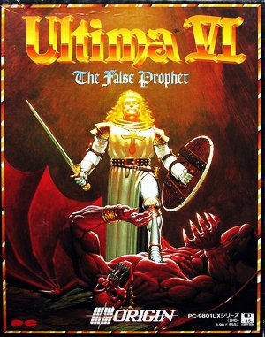
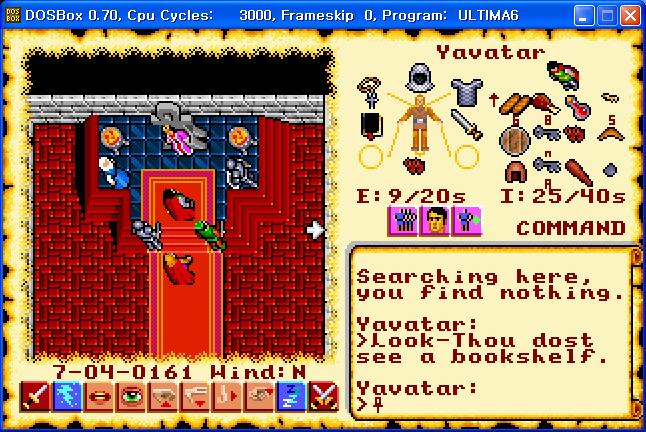

## PC

### Ultima

- [[게임별곡] 전세계 누구나 접속 ‘울티마온라인’ EA 한방 먹이다](https://gametoc.hankyung.com/news/articleView.html?idxno=56677)
- [[게임별곡] 울티마7는 시리즈 최고 명작...회사는 '아마게돈'](https://gametoc.hankyung.com/news/articleView.html?idxno=56618)
- [[게임별곡] 뒤집어 다시 개발한 울티마6...경영난 시작](https://gametoc.hankyung.com/news/articleView.html?idxno=56518)
- [[게임별곡] ‘울티마의 아버지’ 리처드 게리엇 ‘명예의 전당 1호’](https://gametoc.hankyung.com/news/articleView.html?idxno=56451) 
- [[게임별곡] '울티마 8대 미덕' 등장한 진짜 이유?](https://gametoc.hankyung.com/news/articleView.html?idxno=56357)
- [[게임별곡] 모든 RPG 전설의 시작...리처드 게리엇 ‘울티마’](https://gametoc.hankyung.com/news/articleView.html?idxno=56312)
- [[게임별곡100] 영원히 끝나지 않는 이야기 '울티마'](http://www.gametoc.co.kr/news/articleView.html?idxno=26904)

### 게임별곡

- [[게임별곡 76] 경찰 등장 어드벤처 게임 ‘퀘스트’](https://gametoc.hankyung.com/news/articleView.html?idxno=22287)
- [[게임별곡 67] 불멸의 명작게임 ‘페르시아의 왕자’](https://gametoc.hankyung.com/news/articleView.html?idxno=20321)
- [[게임별곡 52] 연재 1주년... 내 인생 명작 ‘C&C’](https://gametoc.hankyung.com/news/articleView.html?idxno=17130)
- [[게임별곡 01] 명작 어드벤처 '원숭이 섬의 비밀 1, 2'](http://www.gametoc.co.kr/news/articleView.html?idxno=8251) 

## Playstation

### FromSoftware

- [다크소울 세계관/스토리 총정리](https://bbs.ruliweb.com/family/4892/board/17/read/49)
- [엘든링 스토리 총정리](https://bbs.ruliweb.com/family/4892/board/185738/read/35950?search_key=%EB%A0%88%EB%82%A0%EB%9D%BC&search_type=subject_content&utm_source=pocket_mylist)
- [블러드본 스토리](https://bbs.ruliweb.com/game/82048/read/8311689?)
- [겜우리](https://gamewoori.com/)
- [Save Wizard](https://www.savewizard.net/)

## YouTube

- [이클리피아](https://www.youtube.com/user/eclipiablog/playlists)
